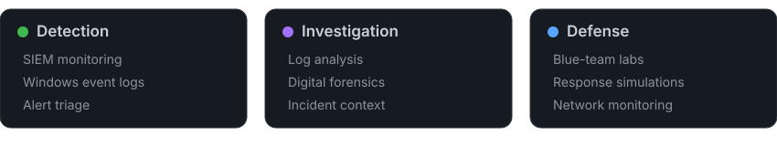

  

## Career Objective
> To build a career as a Security Operations Center (SOC) Analyst where I can apply my knowledge of threat detection, log analysis, incident investigation, and defensive cybersecurity while continuously learning and contributing to organizational security.

## Focus Areas

  

## Technical Toolkit

### Cybersecurity
&nbsp;&nbsp;&nbsp;&nbsp;&nbsp;&nbsp;&nbsp;&nbsp;

### Networking

### Programming
&nbsp;&nbsp;&nbsp;&nbsp;

### Operating Systems
&nbsp;&nbsp;&nbsp;&nbsp;&nbsp;&nbsp;&nbsp;&nbsp;&nbsp;&nbsp;

### Version Control
&nbsp;&nbsp;<picture><source media="(prefers-color-scheme: dark)" srcset="https://cdn.simpleicons.org/github/white"><source media="(prefers-color-scheme: light)" srcset="https://cdn.simpleicons.org/github/181717"></picture>

## Activity

                                    <!-- ACTIVE_DAYS:START -->
  
  <!-- ACTIVE_DAYS:END -->

  

## Contact

  
  
  
  

 
<h4 align="center">O B S E R V E &nbsp;&nbsp;&bull;&nbsp;&nbsp; I N V E S T I G A T E &nbsp;&nbsp;&bull;&nbsp;&nbsp; D E F E N D</h4>