<div align="center">
  
</div>

<p align="center">
  <a href="https://tryhackme.com/p/shakibul742"></a>
  <a href="https://app.letsdefend.io/user/shakibul742"></a>
</p>

## About Me.exe

CyberSecurity Learner focused on defensive operations: understanding telemetry, investigating alerts, and building the discipline to respond with clear evidence.

## Focus Areas

| Area | Current direction |
| :-- | :-- |
| Detection | SIEM monitoring, Windows event logs, and alert triage |
| Investigation | Log analysis, digital forensics, and incident context |
| Defense | Blue-team labs, response simulations, and network monitoring |

## Technical Toolkit

<p>
  
</p>
<p>
  
</p>

`TCP/IP` · `DNS` · `HTTP` · `Splunk` · `Wazuh` · `Windows Event Logs` · `Network Monitoring` · `Digital Forensics`

## Learning Now

```text
01  Digital forensics and evidence collection
02  Splunk and Wazuh workflows
03  Windows log analysis and alert investigation
04  Threat hunting and blue-team incident handling
```

## Activity

<!-- ACTIVE_DAYS:START -->
<p>
  
</p>
<!-- ACTIVE_DAYS:END -->

## Contact

[LinkedIn](https://www.linkedin.com/in/shakibul742/) · [Academic email](mailto:shakibul.240112@s.pust.ac.bd) · [Personal email](mailto:shakibul74254285@gmail.com) · [Facebook](https://www.facebook.com/shakibul742.cse.pust)

<p align="center">
  <sub>OBSERVE · INVESTIGATE · DEFEND</sub>
</p>
