  

## Career Objective
> To build a career as a Security Operations Center (SOC) Analyst where I can apply my knowledge of threat detection, log analysis, incident investigation, and defensive cybersecurity while continuously learning and contributing to organizational security.

## Focus Areas

  

## Technical Toolkit

### Cybersecurity

   &nbsp;
   &nbsp;
   &nbsp;
   &nbsp;
  

### Networking

  

### Programming

   &nbsp;
   &nbsp;
  

### Operating Systems

   &nbsp;
   &nbsp;
   &nbsp;
   &nbsp;
   &nbsp;
  

### Version Control

   &nbsp;
  

## Activity

<!-- ACTIVE_DAYS:START -->
**Total active days:** `178`
<!-- ACTIVE_DAYS:END -->

## Contact

[LinkedIn](https://www.linkedin.com/in/shakibul742/) · [Academic email](mailto:shakibul.240112@s.pust.ac.bd) · [Personal email](mailto:shakibul74254285@gmail.com) · [Facebook](https://www.facebook.com/shakibul742.cse.pust)

OBSERVE · INVESTIGATE · DEFEND